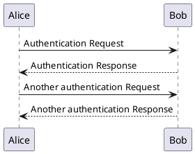
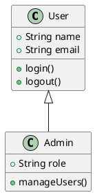
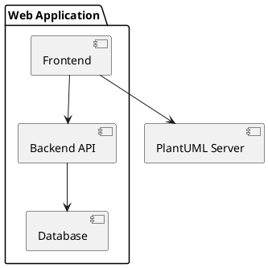

# Test PlantUML Integration

This is a test document with PlantUML diagrams.

## Simple Sequence Diagram

## Class Diagram

## Component Diagram

## Regular Markdown

This is regular markdown text that should render normally.

- List item 1
- List item 2
- List item 3

**Bold text** and *italic text*.
