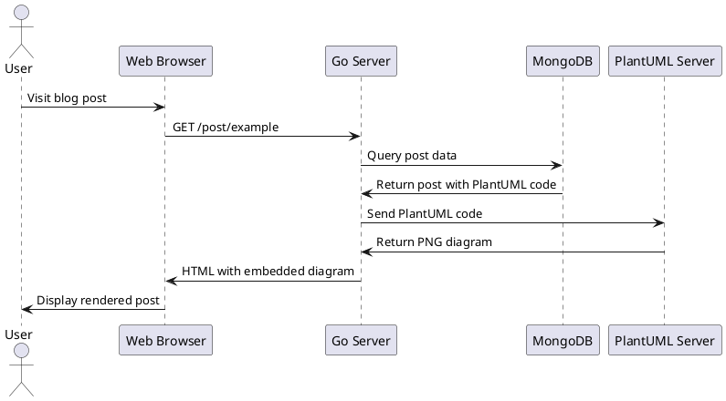
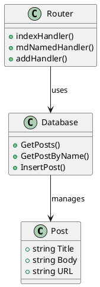
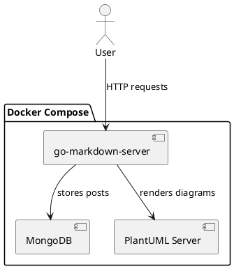
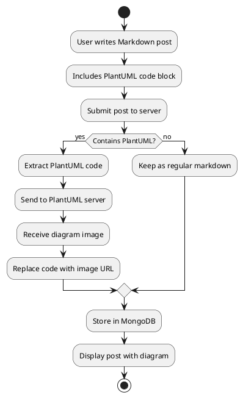
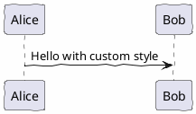

# PlantUML Integration in go-markdown-server

## Overview

This project now supports rendering PlantUML diagrams directly in Markdown posts.

## How It Works

1. **PlantUML Server** - Docker container with PlantUML server (`plantuml/plantuml-server:jetty`)
2. **PlantUML Module** - Go code that finds PlantUML blocks in Markdown and replaces them with images
3. **Automatic Processing** - All posts are processed before being displayed

## Usage

### Embedding PlantUML Diagrams

In your Markdown text, use the syntax:

```plantuml
Alice -> Bob: Hello
Bob -> Alice: Hi there!
```

This will automatically render as a diagram image.

### Examples

#### 1. Sequence Diagram



#### 2. Class Diagram



#### 3. Component Diagram



#### 4. Activity Diagram



## External .puml Files

You can also reference external PlantUML files:

```markdown

```

The server will:
1. Load the `.puml` file from the filesystem
2. Send it to the PlantUML server for rendering
3. Return the generated diagram image
4. Display it inline in your document

## Configuration

### Environment Variables

The PlantUML integration uses two URL configurations:

- `PLANTUML_SERVER` - Internal server URL for processing (default: `http://plantuml:8080`)
- `PLANTUML_PUBLIC_URL` - Public URL for browser to fetch images (default: `/plantuml`)

These are set in `docker-compose.yml`:

```yaml
services:
  web:
    environment:
      PLANTUML_SERVER: http://plantuml:8080
      PLANTUML_PUBLIC_URL: /plantuml
```

### Docker Compose Setup

The PlantUML server runs in its own container:

```yaml
plantuml:
  container_name: plantuml
  image: plantuml/plantuml-server:jetty
  ports:
    - "8081:8080"
```

Access it directly at: http://localhost:8081

## Diagram Types Supported

PlantUML supports many diagram types:

- **Sequence diagrams** - Show interactions between objects
- **Use case diagrams** - Display system functionality
- **Class diagrams** - Show object-oriented structure
- **Activity diagrams** - Describe workflows
- **Component diagrams** - Show system architecture
- **State diagrams** - Represent state machines
- **Object diagrams** - Show object instances
- **Deployment diagrams** - Display hardware/software
- **Timing diagrams** - Show time-based interactions
- **Network diagrams** - Illustrate network topology
- **Wireframes** - UI mockups (Salt)
- **Archimate diagrams** - Enterprise architecture
- **Gantt charts** - Project scheduling
- **MindMaps** - Hierarchical information
- **WBS diagrams** - Work breakdown structure
- **JSON/YAML visualization** - Data structure diagrams

## Advanced Features

### Skinparam Customization

The PlantUML module automatically injects default styling to match document fonts:

```go
skinparam defaultFontSize 11
skinparam defaultFontName Arial
```

You can override these in your diagrams:



### Link Normalization

Cross-references in Markdown are automatically normalized:
- `[link](./file.md)` → `[link](/post/file)`
- `[link](file.md)` → `[link](/post/file)`

This works for both regular markdown links and links within PlantUML diagrams.

## Testing

Example PlantUML test files are available in:
- `content/Doc/examples/test-plantuml.md` - Multiple diagram types
- `content/Doc/examples/test-plantuml-simple.md` - Simple sequence diagram

## Troubleshooting

### Diagrams not rendering

1. Check PlantUML server is running:
   ```bash
   docker ps | grep plantuml
   ```

2. Check PlantUML server logs:
   ```bash
   docker logs plantuml
   ```

3. Verify environment variables in `docker-compose.yml`

4. Test PlantUML server directly at http://localhost:8081

### Syntax errors

If your diagram doesn't render, check:
- PlantUML syntax is correct
- Code block uses \`\`\`plantuml (not \`\`\`puml or other variants)
- Diagram starts with `@startuml` and ends with `@enduml` (when using full syntax)

### Performance

Large or complex diagrams may take longer to render. The PlantUML server processes them on-demand. Consider:
- Simplifying overly complex diagrams
- Breaking large diagrams into smaller components
- Using caching (future feature)

## More Information

- [PlantUML Official Documentation](https://plantuml.com/)
- [PlantUML Language Reference](https://plantuml.com/guide)
- [PlantUML Server Docker Image](https://hub.docker.com/r/plantuml/plantuml-server)
