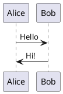

# Go Markdown Server with PlantUML Support

Lightweight Markdown documentation server with PlantUML diagram support, MongoDB storage, and real-time updates.

## About This Fork

This project is a fork of the original [go-markdown-server](https://github.com/beldmian/go-markdown-server) by [beldmian](https://github.com/beldmian). The primary goal of this fork is to extend the original functionality with comprehensive PlantUML diagram rendering support, allowing technical documentation to include inline UML diagrams, sequence diagrams, component diagrams, and other PlantUML-based visualizations directly within markdown files.

Key enhancements in this fork:
- Integrated PlantUML server for automatic diagram rendering
- Support for both inline PlantUML code blocks and external .puml files
- Enhanced collection management for uploaded documentation sets
- MongoDB persistent storage with backup utilities
- Real-time browser updates via Server-Sent Events

For the original project, see: https://github.com/beldmian/go-markdown-server

## Features

- Markdown Rendering - Beautiful rendering with Blackfriday
- PlantUML Diagrams - Inline diagram support with dedicated PlantUML server
- Collections - Organize documentation in logical groups
- Full-Text Search - Search across all documents and collections
- Auto-Sync - Watch filesystem changes and auto-import from content/ directory
- Real-Time Updates - Server-Sent Events for live UI refresh without manual refresh
- Docker Ready - Full Docker Compose setup included
- MongoDB Storage - Persistent document storage with backup scripts
- Multi-file Upload - Upload markdown files via web interface or API
- REST API - Full API for programmatic access

## Quick Start

### Prerequisites

- Docker & Docker Compose
- Go 1.21+ (for local development)

### Run with Docker

```bash
# Clone the repository
git clone https://github.com/beldmian/go-markdown-server.git
cd go-markdown-server

# Start all services
./rebuild.sh
```

Access the server at: http://localhost:8080

### Services

| Service | Port | Description |
|---------|------|-------------|
| Web Server | 8080 | Main application |
| MongoDB | 27017 | Document database |
| PlantUML | 8081 | Diagram rendering |

## Usage

### Auto-Sync from Filesystem

The server can automatically watch and import markdown files from a directory:

```yaml
# docker-compose.yml
services:
  web:
    environment:
      AUTO_SYNC: "true"           # Enable auto-sync
      SYNC_DIR: /app/content      # Directory to watch
    volumes:
      - ./content:/app/content:ro # Mount your markdown files
```

When enabled:
- Server watches the `content/` directory for changes
- New/modified markdown files are automatically imported to MongoDB
- Collections are created based on subdirectory structure
- Browser UI updates in real-time via Server-Sent Events (no manual refresh needed)

Example directory structure:
```
content/
├── Architecture/
│   ├── index.md
│   └── design.md
└── API/
    ├── index.md
    └── endpoints.md
```

This creates two collections: "Architecture" and "API".

### Upload via Web Interface

1. Open http://localhost:8080
2. Click "Upload Collection" button
3. Select multiple markdown files or an entire directory
4. Files are uploaded and imported automatically
5. Collections list updates without page refresh

### Import via Command Line

```bash
# Import all .md files from a directory
./import-posts.sh ./docs MyCollection

# Auto-detects collection name from directory
./import-posts.sh ./content/Documentation
```

The import script uses the modern `/api/collection/create` endpoint which:
- Accepts multiple files in one request
- Triggers real-time UI updates
- Returns success/failure status

### PlantUML Diagrams

Simply use PlantUML code blocks in your Markdown:

````markdown

````

Or reference external `.puml` files:

```markdown

```

See [PLANTUML_USAGE.md](PLANTUML_USAGE.md) for detailed examples.

### Collection Organization

You have two ways to organize collections:

**Option 1: Custom Index (Manual Control)**
- Create a file named `index.md` or `README.md` in your collection
- This file becomes the landing page for the collection
- You manually create the structure and links to other documents
- Full control over navigation and presentation

Example `index.md`:
```markdown
# My Documentation

## Getting Started
- [Installation Guide](installation)
- [Quick Start](quickstart)

## Advanced Topics
- [API Reference](api)
- [Architecture](architecture)
```

**Option 2: Auto-Generated List (Zero Config)**
- Don't create an `index.md` or `README.md`
- Server automatically generates a list of all markdown files
- Each file appears as a clickable link
- Perfect for simple collections where file browsing is enough

The system will display:
```markdown
# CollectionName
---
- [File One](/post/file-one)
- [File Two](/post/file-two)
- [File Three](/post/file-three)
```

Choose the approach that fits your documentation style!

### API Endpoints

#### Collections
- `GET /collections` - List all collections
- `GET /collection/{name}` - View collection
- `POST /api/collection/create` - Create collection with files
- `POST /api/collection/{name}/upload` - Upload files to existing collection
- `DELETE /api/collection/{name}/delete` - Delete collection

#### Posts
- `GET /post/{name}` - View single post
- `POST /add` - Add post (legacy API)

#### Sync
- `GET|POST /api/sync` - Trigger manual sync from `content/` directory

## Configuration

### Environment Variables

```bash
PORT=8080                              # Web server port
SYNC_DIR=/app/content                  # Directory to watch for markdown files
AUTO_SYNC=true                         # Enable automatic file watching
PLANTUML_SERVER=http://plantuml:8080   # Internal PlantUML server URL
PLANTUML_PUBLIC_URL=/plantuml          # Public PlantUML URL for browser
```

### Docker Compose

Customize `docker-compose.yml` for your needs:

```yaml
services:
  web:
    environment:
      AUTO_SYNC: "true"  # Enable/disable auto-sync
    volumes:
      - ./content:/app/content:ro  # Mount your markdown files
```

## Backup & Restore

### Backup MongoDB

```bash
./backup-mongodb.sh
```

Creates timestamped backup in `./backups/`. Keeps last 5 backups automatically.

### Restore MongoDB

```bash
./restore-mongodb.sh backups/mongodb-backup-20251212_143000.tar.gz
```

**Important:** MongoDB data persists in `./data/mongodb/` directory.

## Architecture

```
┌─────────────┐
│   Browser   │
└──────┬──────┘
       │ HTTP
       ↓
┌─────────────────────────┐
│  Go Markdown Server     │
│  - Routes & Handlers    │
│  - PlantUML Processing  │
│  - File Sync Watcher    │
│  - SSE Broadcasting     │
└────┬─────────────┬──────┘
     │             │
     ↓             ↓
┌─────────┐  ┌────────────┐
│ MongoDB │  │  PlantUML  │
│         │  │   Server   │
└─────────┘  └────────────┘
```

See [Doc/README.md](Doc/README.md) for detailed architecture documentation.

## Development

### Build Locally

```bash
# Install dependencies
go mod download

# Build
go build -o goapp

# Run
PORT=8080 ./goapp
```

### Project Structure

```
├── main.go              # Server initialization, routing
├── routes.go            # HTTP handlers
├── db/                  # MongoDB access layer
│   └── datebase.go
├── plantuml/            # PlantUML processing
│   └── plantuml.go
├── filesync/            # File watching and sync
│   └── filesync.go
├── md.html              # Main UI template
├── content.html         # Content-only template (iframe)
└── content/             # Markdown source files
    └── Doc/             # Example collection
```

## Security Notes

- **API Key:** Currently hardcoded (`124252`) - implement proper authentication before production use
- **CORS:** Not configured - add CORS headers if needed for external clients
- **Rate Limiting:** Not implemented - consider adding for public deployments

## Documentation

- [PlantUML Usage Guide](PLANTUML_USAGE.md) - Detailed PlantUML examples
- [Architecture Documentation](Doc/README.md) - System architecture and design
- [Services Diagram](Doc/diagrams/services-architecture.puml) - Visual architecture

## Contributing

1. Fork the repository
2. Create a feature branch (`git checkout -b feature/amazing-feature`)
3. Commit your changes (`git commit -m 'Add amazing feature'`)
4. Push to the branch (`git push origin feature/amazing-feature`)
5. Open a Pull Request

## License

This project is open source. See LICENSE file for details.

## Troubleshooting

### Build fails with vendor error
- Fixed in latest version - now uses `go mod download` instead of vendor

### PlantUML diagrams not rendering
- Check PlantUML server is running: `docker ps | grep plantuml`
- Check logs: `docker logs plantuml`
- Verify `PLANTUML_SERVER` environment variable

### MongoDB data lost after restart
- Ensure `data/mongodb` volume is mounted in `docker-compose.yml`
- Run `./backup-mongodb.sh` regularly

### Auto-sync not working
- Verify `AUTO_SYNC=true` in docker-compose.yml
- Check `SYNC_DIR` points to correct directory
- Check logs: `docker logs go-markdown-server`

## Support

- Issues: https://github.com/beldmian/go-markdown-server/issues
- Original Project: https://github.com/beldmian/go-markdown-server
